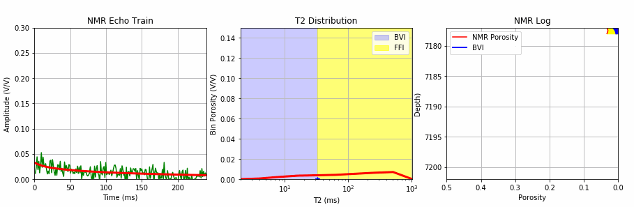

# NMR-Echo-Train-Inversion-to-created-a-typical-NMR-log
This repository contains the SciPy python application code for NMR Echo Train inversion to create a typical NMR log, T2 distributions and NMR log outputs from the Time-Domain echo train data. 

Back in 1994 when we at Western Atlas were preparing our own software for NMR Inversion from the Time-Domain Echo Train to the T2 distribution for the MRIL C tool, Dan Georgi initiated some very intuitive software for the process as shown below. The objective was to determine the NMR T2 bin porosities from the echo train data and create the typical MRIL outputs of the effective NMR porosity (MPHI), NMR Capillary Bound Water (MBVI) and Free Fluid (MFFI). The example below shows this process over a short section of NMR log. In this example code you do have control over adding noise to the echo train data and stacking adjacent echo trains to the S/N values, but at the cost of lower resolution for the final NMR log. 

In this repository We have provided the python code using SciPy's curve_fit to perform the NMR inversion. 

    *def func(x,p1,p2,p3,p4,p5,p6,p7,p8):
        return (p1*np.exp(-x/4)+p2*np.exp(-x/8)+p3*np.exp(-x/16)+p4*np.exp(-x/32)+p5*np.exp(-x/64)+p6*np.exp(-x/128)+p7*np.exp(-x/256)+p8*np.exp(-x/512))

    popt, pcov = curve_fit(func, xdata, ystack, method='trf', bounds=(0.05, [20, 20, 20, 20, 20, 20, 20, 20]))*

This method might be a bit unorthodox for typical NMR Echo Train inversion, but it does provide a SciPy's example for this process. 

The sample code and sample data can be found in this repository. Please download all the data and run the python program from the downloaded subdirectory. 

Please consider this simple example as work in progress, as we are now investigating other python techniques too. 
